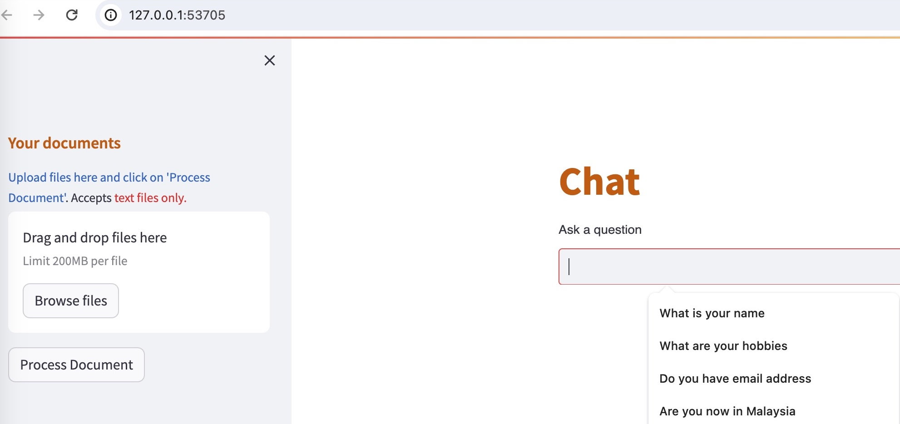

**Table of Contents**
- [Overview](#overview)
  - [Tech Stack](#tech-stack)
  - [Prerequisite](#prerequisite)
  - [Folder Structure](#folder-structure)
- [How to Use](#how-to-use)
  - [Streamlit](#streamlit)
  - [API](#api)
  - [Docker](#docker)
  - [Minikube](#minikube)


# Overview
A chatbot answers questions based on uploaded files, including an API (backed by FastAPI) and a web page (backed by Streamlit).

## Tech Stack
- Langchain
- HuggingFace
  - google/flan-t5-large as LLM (notes: my machine is a bit slow so I didn't choose other huge models)
  - hkunlp/instructor-large for generating embeddings
- Streamlit
- FastAPI

## Prerequisite
- Python (**3.9.X**), mine is 3.9.6
- Hugging Face API access token
  - Add the access token to the .env file (under project root directory)
- Docker (build, compose, etc.)
- Minikube (kubernetes local cluster)
- Google Chrome

## Folder Structure
```
├── Dockerfile: For building Docker image
├── README.md
├── api
│   ├── main.py: FastAPI server entry point
│   ├── qarequest.py: API request object
│   ├── qaresponse.py: API response object
│   └── router.py: Define API routes
├── config.py: Process .env
├── kubernetes.yaml: Provision Minikube
├── model
│   └── transform.py: Process text file
├── requirements.txt: Project dependencies
├── resources: Contains images used by readme
├── sample.txt: My simplified profile information
└── streamlit_app
    ├── app.py: Streamlit app entry point
    └── htmlTemplates.py: Customize Streamlit UI
```

# How to Use
## Streamlit
Steps:
- Install Python dependencies if not installed yet
```pip3 install -r requirements.txt```
- Execute the following command from the project root directory
```python3 -m streamlit run streamlit_app/app.py --server.port=8501 --server.address=0.0.0.0```

- Once the command executed successfully, a web page will be automatically opened 


- At the left side pane, upload the sample.txt (under the project root directory). It will take some time to process the file.
- Wait for the file processing to complete, then at the right side pane (Chat pane), type your question and press Enter.
  - Alternatively, you can choose any pre-defined question from the dropdown component (as shown in the figure above).

## API
Steps:
- Install Python dependencies if not installed yet
```pip3 install -r requirements.txt```
- Execute the following command from the project root directory
```python3 -m uvicorn api.main:app --reload --port 8502```  

- Wait for application startup to complete, until the following message is displayed on the terminal:
```INFO: Application startup complete.```

- Then you can use a HTTP client to invoke the API, here is an example.


## Docker
Notes:
- Allocate enough memory to the container (for my testing, I allocated 8G)
- I am using Colima instead of Docker Desktop, so I am not sure if there is any issue if you use Docker Desktop directly. 

Steps:
- Execute the following command from the project root directory.
```DOCKER_BUILDKIT=0 docker build -t poc_chatbot:1.0.0 .```

- Wait for the image creation to complete, then execute the following command to create and start the container.
```docker run -it -p 8501:8501 poc_chatbot:1.0.0```

- Once the container started, open ```http://0.0.0.0:8501``` in your browser.

Notes:
- This Docker container only exposes the Streamlit web app. 

## Minikube
Steps:
- Execute the following command from the project root directory, this will create minikube container if not exist yet
```minikube start --driver=docker```

- Then execute the following command to add Docker image to Minikube.
```minikube image load poc_chatbot:1.0.0```
  - Notes: The chatbot Docker image should be created beforehand, see instructions in the Docker (#docker) section

- Next, execute command to create a local Kubernetes cluster
```kubectl apply -f kubernetes.yaml```

- Finally, execdute command to open the Streamlit app in browser.
```minikube service chatbot-service```
  - Command output

  - Streamlit app


- In case you encounter HTTP 400 error while uploading file, please refersh the page and retry


Notes:
- This Minikube deployment only exposes the Streamlit web app. 
- You may refer to this document if encountered any issue related to Minikube: https://www.baeldung.com/ops/docker-local-images-minikube
